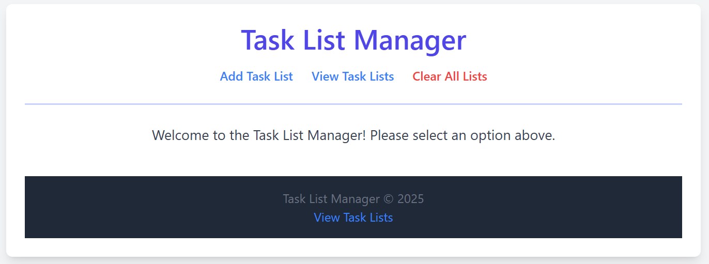
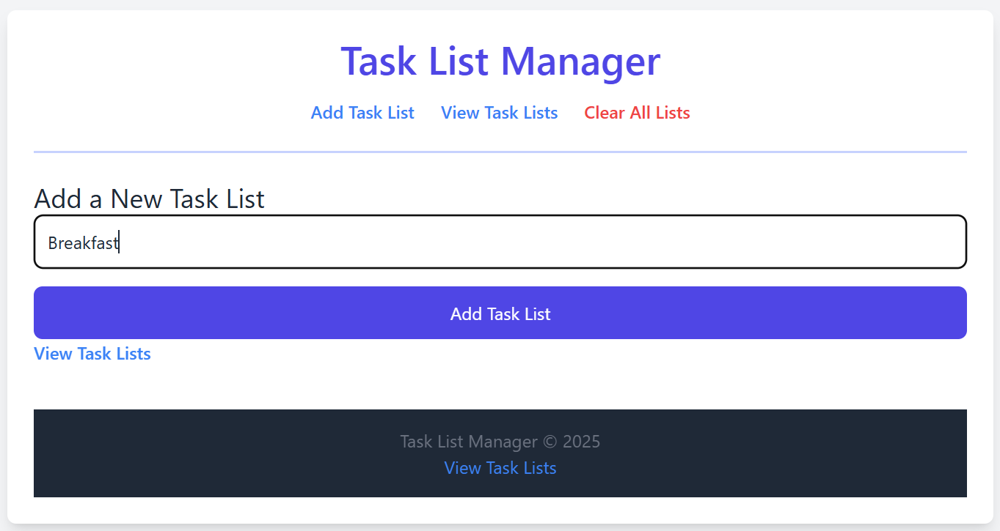
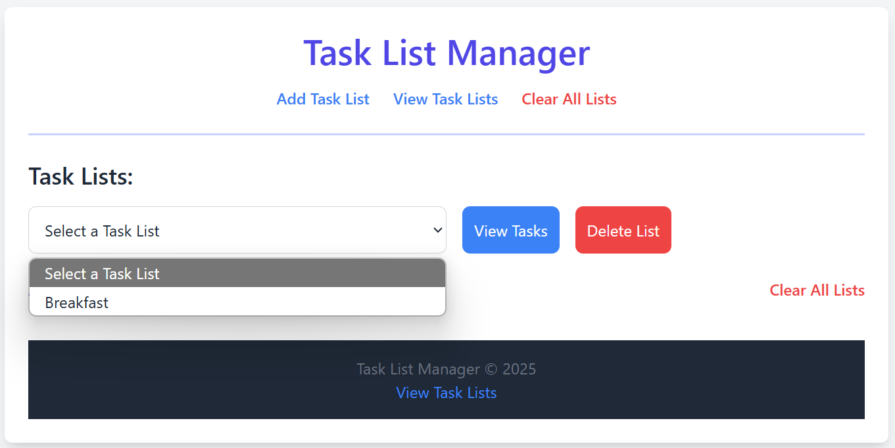
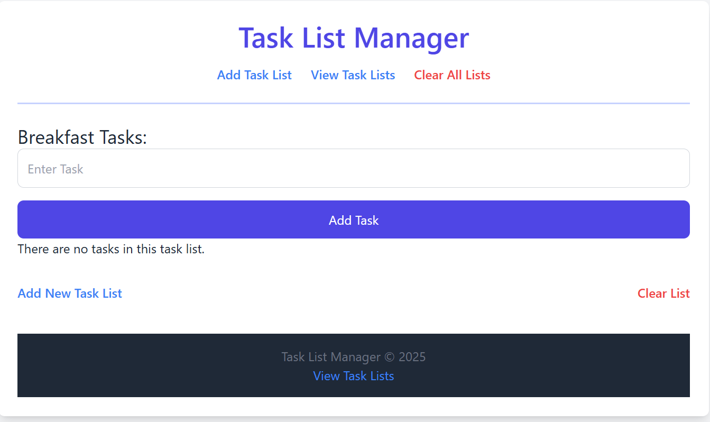
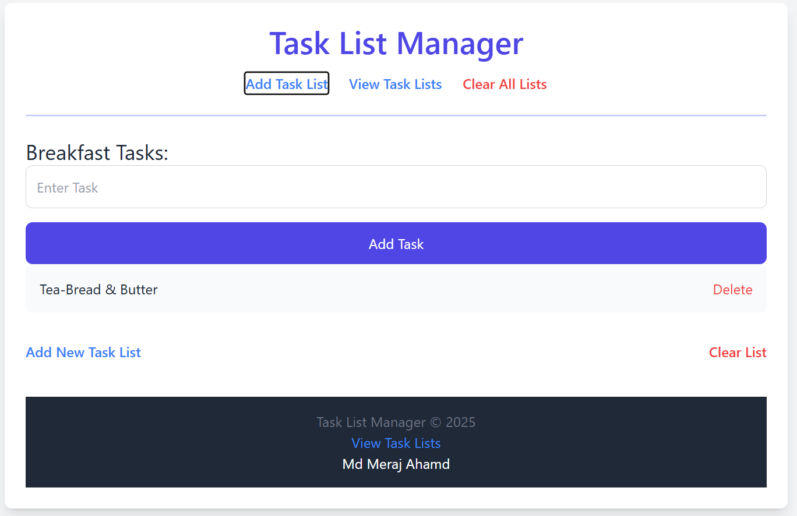
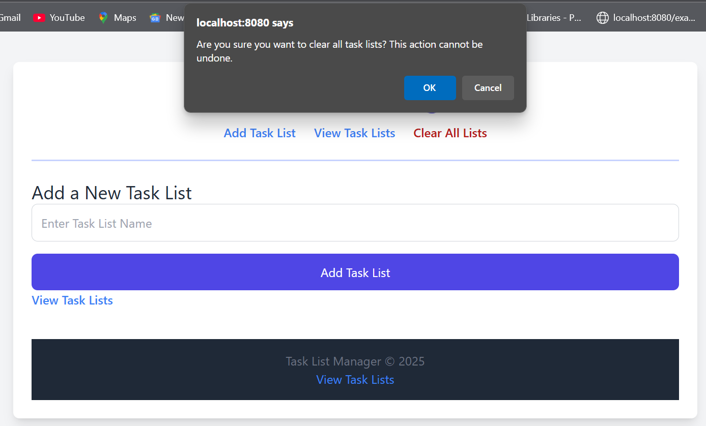

# Task List Manager

A simple and interactive task list management application built with PHP and Tailwind CSS. This web-based application allows users to create task lists, add tasks, delete tasks, and clear all lists. It provides a clean and user-friendly interface for managing tasks.

# Home OverView

# Add Task List

# View Task List

# Blank Task

# Add Task

# Clear or Delete Task

## Features

- **Add Task Lists**: Create multiple task lists with custom names.
- **Add Tasks**: Add tasks to a specific list.
- **View Tasks**: View tasks in a selected list.
- **Delete Tasks**: Remove tasks from the list.
- **Delete Task Lists**: Delete entire task lists.
- **Clear All Lists**: Clear all task lists with a confirmation prompt.
- **Responsive Interface**: Built with Tailwind CSS for a responsive design.

## Technologies Used

- **PHP**: Server-side scripting language for business logic.
- **Tailwind CSS**: Utility-first CSS framework for styling.
- **Session Management**: Data is stored in PHP sessions to keep track of task lists and tasks.

## Installation

### Prerequisites

To run this project locally, you need to have the following installed:

- PHP (7.4 or later)
- A web server (e.g., Apache, Nginx) with PHP support
